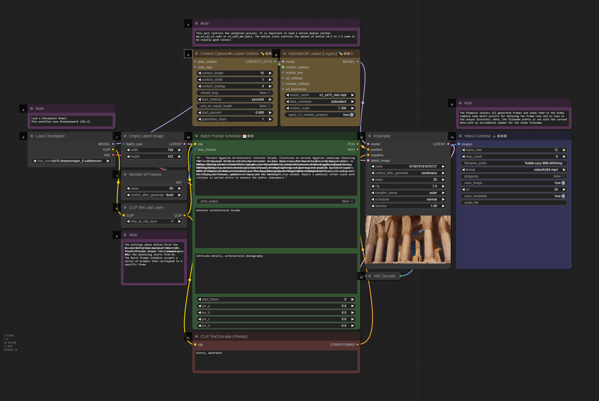

# Advanced_Lab-Synthetic_Media

**Interactive Media Arts, NYU Shanghai**
**Instructor:** Dr. Stavros Didakis  
**Email:** `stavros.didakis@nyu.edu`  
**Course number:** INTM-SHU 306  
**Course Title:** Advanced Lab: Synthetic Media

---

**Course Description:**  
The course **Advanced Lad: Synthetic Media** investigates emerging trends in machine learning and artificial intelligence for generating media content - images, video, sound. The course explores the idea of how artists, designers, and creators can use machine learning in their own research, production, and development processes. Students learn and understand machine-learning techniques and use them to generate media content (images, videos, sounds, 3D, immersive spaces). The course covers a range of related platforms and models and also provides the frameworks to experiment with implementing interaction and virtuality within the creative work.

---

**Instructional Mode:** In-person  

**Co-requisite or Prerequisite:** Communications Lab, What’s New Media, OR Emerging Technologies & Computational Arts  

**Class Details:** Meets once a week (150 mins per session), N405  

---

**Learning Objectives:**  
Upon completion of this course, students will be able to:
- Understand the concept of synthetic media and the technologies it involves
- Learn about machine learning and generative A.I. and how to apply it within an artistic context
- Analyze the creative and artistic dimensions of synthetic media
- Work with state-of-the-art platforms and models for generating synthetic media content
- Experiment with implementing the generated media content with platforms for interaction design and virtual reality
- Develop critical thinking skills through analyzing and reflecting on the implications of synthetic media in society and culture

<details>
  <summary><strong>Course Policies</strong></summary>

**Attendance and Tardiness**  
Students are expected to attend *all* scheduled classes. If unable to attend a class, a student needs to notify the instructor *before* class.

---

**Absences and Grades**  
- 4 absences will lead to an F for the participation grade.
- 6 absences will lead to a 25% reduction in the final grade.
- 8 absences will lead to failure of the course.

---

**Absence Exceptions**  
- **Observance of Religious Holidays:** You may miss class for the observance of religious holidays. If you anticipate being absent because of religious observance, notify me in advance so we can create a plan for making up missed work. For more on this policy [see here](https://www.nyu.edu/about/policies-guidelines-compliance/policies-and-guidelines/university-calendar-policy-on-religious-holidays.html).
- **Competitions, Conferences, Presentations:** You are permitted to be absent from classes to participate in competitions, conferences, and presentations, either at home or out of town, as approved by the Associate Provost for Academic Affairs. Review the Undergraduate Bulletin for the conditions you must meet to obtain approval for this kind of absence.
- **Extended Illness:** A student with an injury or medical condition that requires ongoing accommodations (temporary or permanent) should contact the NYU Moses Center for Student Accessibility (CSA). If an accommodation is recommended by the Moses Center, then Academic Affairs may communicate on behalf of students to advocate for excused absences/extensions. Reasonable accommodations, considering the course objectives, student learning, and fair standards, are ultimately decided by the professor.

---

**Tardiness**  
Punctual arrival is mandatory for this class. Students need to be on time and not leave in the middle of class unless it is an emergency.

---

**Late Assignments**  
Assignments are due **at the date and time indicated on this syllabus**. The late penalty for *all assignments* is one-third of a letter grade per day (an A becomes an A-, etc.). All other late assignments will earn an F.

---

**Electronic Devices**  
- **Mobile Devices:** Students may not use mobile devices in class unless otherwise indicated.
- **Recording Class:** To ensure the free and open discussion of ideas, students may not record classroom lectures, discussions, and/or activities without the instructor’s advance written permission; any such recording can be used solely for their own private use. If a student has approved accommodations from the Office of Disability Resources permitting the recording of class meetings, the student must present the accommodation letter to the instructor in advance of any recording. On any days when classes will be recorded, the instructor will notify all students in advance. Distribution or sale of class recordings is prohibited without the written permission of the instructor and other students who are recorded.

---

**Instructional Technology**  
- **Email Communication:** The course instructor will contact students regularly via email. Students should check for emails from the instructor that will cover in detail reminders, logistics, updates, and so on. Please note that the instructor will try to respond to all emails within 24 hours. Students should not expect immediate responses to emails sent late at night, during holidays, or on the weekends.
- **Assignment Notification:** All assignments will be posted on the course website. Each student is responsible for reviewing the website and its resources. After each class period, the students are asked to learn about the next homework assignment or other requirements and responsibilities related to the course.
- **Instructional Technology Tools and Assistance:** If you need background on specific instructional technology tools, such as Zoom, NYU LMS (Brightspace) and Voicethread, check the [RITS Student Toolkit](https://wp.nyu.edu/shanghai-online_learning/). You may also email [shanghai.rits@nyu.edu](mailto:shanghai.rits@nyu.edu) for assistance.

---

**Academic Honesty/Plagiarism**  
Carefully read NYU Shanghai’s *Statement on Academic Integrity* (in the [Undergraduate Bulletin](https://shanghai.nyu.edu/academics/curriculum/bulletin)). Breaches of academic integrity could result in failure of an assignment, failure of the course, or other sanctions, as determined by the Academic Affairs office.

---

**Disability Disclosure Statement**  
NYU Shanghai is committed to providing equal educational opportunity and participation for students with disabilities. It is NYU Shanghai’s policy that no student with a qualified disability is excluded from participating in any NYU Shanghai program or activity, denied the benefits of any NYU Shanghai program or activity, or otherwise subjected to discrimination with regard to any NYU Shanghai program or activity. Any student who needs reasonable accommodation based on a qualified disability should register with the [Moses Center for Student Accessibility](https://www.nyu.edu/students/communities-and-groups/student-accessibility.html) for assistance. Students can [register online](https://www.nyu.edu/students/communities-and-groups/student-accessibility/academic.html) through the Moses Center and can contact the Academic Accommodations Team at [shanghai.academicaccommodations@nyu.edu](mailto:shanghai.academicaccommodations@nyu.edu) with questions or for assistance.

---

**Title IX Statement**  
Title IX of the Education Amendments of 1972 (Title IX) prohibits discrimination on the basis of sex in educational programs. It protects victims of sexual or gender-based bullying and harassment and survivors of gender-based violence. Protection from discrimination on the basis of sex includes protection from being retaliated against for filing a complaint of discrimination or harassment. NYU Shanghai is committed to complying with Title IX and enforcing University policies prohibiting discrimination on the basis of sex. Mary Signor, Executive Director of the Office of Equal Opportunity, serves as the University’s Title IX Coordinator. The Title IX Coordinator is a resource for any questions or concerns about sex discrimination, sexual harassment, sexual violence, or sexual misconduct and is available to discuss your rights and judicial options. University policies define prohibited conduct, provide informal and formal procedures for filing a complaint, and a prompt and equitable resolution of complaints.

---

**Links to the Title IX Policy and related documents:**
- [Sexual Misconduct, Relationship Violence, and Stalking Policy](https://www.nyu.edu/about/policies-guidelines-compliance/policies-and-guidelines/sexual-misconduct--relationship-violence--and-stalking-policy.html)
- [Procedures for Complaints Against Students](https://www.nyu.edu/about/policies-guidelines-compliance/policies-and-guidelines/test-reporting--investigating--and-resolving-sexual-misconduct--rela.html)
- [Procedures for Complaints Against Employees](https://www.nyu.edu/about/policies-guidelines-compliance/policies-and-guidelines/reporting--investigating--and-resolving-sexual-misconduct--relat.html)
- [Resource Guide for Students](https://www.nyu.edu/about/policies-guidelines-compliance/policies-and-guidelines/sexual-misconduct--relationship-violence--and-stalking-resource-.html)
- [Resource Guide for Employees](https://www.nyu.edu/about/policies-guidelines-compliance/policies-and-guidelines/sexual-misconduct--relationship-violence--and-stalking-resource-0.html)

</details>

<details>
  <summary><strong>Assignments & Grading</strong></summary>
For all assignments, you are required to demonstrate three important skills:

- **Divergence:** A need to showcase thorough research, investigation, and experimentation. It is often impossible to reach superb results if the initial research is limited and lacks depth and quality of resources or information.
- **Criticality:** It is paramount to be able to critically reflect on the researched or practiced content and identify what to keep and what to ignore. This skill can be sharpened if you are exposed frequently and to a sufficient amount of content from other artists and practitioners and understand in more detail their methods and motivations.
- **Convergence:** After you have done a wide series of experiments and you have critically reflected on the content, you need to showcase your convergence skills. In this stage, it is essential to focus on the optimization and exceptional refinement of your content. Rough outputs that lack numerous reiterations show poor results, even if the previous stages are completed perfectly. Consider planning ahead of time for making the necessary refinements that will showcase incredible final results.

---

### Assignment 1
- ***Self, Perception, Archetypes*** (medium: text & images)
- **Prompt:** Create a series of images that showcase what a human being is; this needs to come from your subjective perspective and it has to depend on your analysis and methodology. A human being can be viewed through different lenses - can you provide a creative and original interpretation? Use generative AI (in combination with other media design tools as they may seem appropriate/fit) to provide your own subjective (and original) interpretation of what a human being is.
- **Deliverables:** 
  - Provide 20 images that showcase your interpretations. Size of images should be at least FullHD (1920x1080px / 1080x1920px / 1920x1920px). Acceptable filetypes: PNG/JPEG. Zip the images and attach the zip file to the email.
  - Provide a poem or literature excerpt to accompany your images (text format with proper referencing). The text needs to exist already and it has to support your aesthetic and ideological reflections.
  - **Presentation:**
    - Select at least 3 final images at any aspect ratio and configuration. The images need to be printed on high-quality paper and presented/explained in class.
    - Print your poem or literature excerpt to accompany your 3 final presented images.

---

### Assignment 2 (Midterm)
- ***Machines in Motion*** (medium: video, animation, sound)
- **Prompt Option 1**
  By using the images generated in **Assignment 1** (or an update, depending on your preference), create a video between 2 to 4 minutes using generative AI. The video needs to have a music layer and a narration for your poem/literature excerpt.
  - **Deliverables:**
    - A video clip with a length of 2-4 minutes, in .MP4 format, 1080p/2160p, 16:9 aspect ratio, 30fps.
    - Your workflows (as images with the embedded code). The workflow needs to be an advanced iteration from the ones shared in class and showcase a particular development that aligns with your concept and intentions.
    - A file (pdf) that explains your workflow, together with your intentions and methodologies. Explain what your artistic approach is, and how you derived the final results. You may include notes on things that worked well, and things that did not work as expected.

- **Prompt Option 2**
  Select this option if you are interested to work on a collaboration project for a festival submission. Participants need to produce content that follows specific instructions.
  - **Deliverables:** 
    Submit weekly a specific list of generated content (variable specs will be given to you, depending on the workflow and production process).

---

### Assignment 3
- ***Ad Virtualitas ad Infinitum (groups of 2)*** (medium: realtime 3D/VR)
- **Prompt:** For this assignment, you are asked to create a virtual space that consists of generative-AI assets (images, videos, sounds, 3D objects, skyboxes).
- **Deliverables:** Send via email (`stavros.didakis@nyu.edu`) the following:
  1. A rendered video of the final performance (using the Unity Recorder). The final video needs to have a length of around 1 minute that showcases in detail your scene (.MP4 format, 1920x1080p, 16:9 aspect ratio, 30fps).
  2. Screenshots of your Unity project.
  3. A written report (pdf) that explains your intentions and methodologies. Explain what your artistic approach is, and how you derived the final results. You may include notes on things that worked well, and things that did not work as expected (length ~300 words).

---

### Assignment 4 (Final)
- ***Final Project*** (medium: open/mixed)
- **Prompt Option 1** (group of 3): Development of a physical media installation that includes selected content created during assignments 1, 2, and 3. The work includes the design of the structure for accommodating the media components, hardware installation, and tweaking and editing the content (prints, videos, sounds).
- **Prompt Option 2** (independent or groups of 2): For this option, a proposal needs to be pitched for approval. The work needs to have an artistic focus and to utilize tools and methods as the ones covered during the semester but further expand on the usage, bringing a sophisticated and highly polished final result. 
  You may consider creating projects such as the following:
  - An interactive generative system
  - A real-time VR scene
  - A mix of media/techniques/materials

---

### Class Participation & Attendance
Active participation and attendance are essential in this course. Students will be required to proceed to various teaching and learning activities during class, such as discussions, debates, practical exercises, and more.

---

### Homework & Reading Responses
The course necessitates the completion of homework such as readings, writings, and practical exercises. These are important elements that are required for achieving the learning outcomes of this course.

---

### Marking Elements
| Component                         | Weight |
| --------------------------------- | ------ |
| Class Participation & Attendance  | 30%    |
| Assignment 1                      | 15%    |
| Assignment 2                      | 20%    |
| Assignment 3                      | 10%    |
| Assignment 4                      | 25%    |

[The course rubric can be found here](https://docs.google.com/spreadsheets/d/1pJvsyA3RSv_4aOTyX1bs702O-ln5NgTQu87aURWNng0/edit#gid=0).

</details>

<details>
  <summary><strong>Academic Resources</strong></summary>

**ARC Services**
The Academic Resource Center (ARC) offers both individual, one-on-one tutoring as well as group sessions in a variety of ways, in a variety of courses. You can log on to [WCOnline](https://nyus.mywconline.com/index.php?logout=YES) to book an appointment with a Global Writing & Speaking Fellow or a Learning Assistant (LA). The Global Writing & Speaking Fellows conduct individual consultations on writing, speaking, reading, and academic skills coaching. LAs provide both individual and small-group tutoring support in over 30 STEM, Business, Economics, IMA/IMB, and Chinese Language classes. Visit [shanghai.nyu.edu/arc](https://shanghai.nyu.edu/arc) for more information about ARC services.

**Library Services**
The Library is available to support your research needs. They have access to over 27,000 print resources, 2,000 DVDs, and 1,000 databases (including over a million ebooks, as well as streaming audio and video and image databases).

Librarians with expertise in your research topic are available to meet either *in person* or *online* [by appointment](https://nyu-shanghai.libcal.com/appointments) or [by email](https://nyu.qualtrics.com/jfe/form/SV_893SmPggYfKqOz3?Q_JFE=qdg) to help you navigate the research process. Our library team features experts in Business, Arts & Humanities, STEM, Social Sciences & Economics, and data tools & resources. Ask us how we can assist you in developing a research question and formulating a research strategy, selecting databases, requesting materials, and citing your sources. Visit [shanghai.nyu.edu/library](http://shanghai.nyu.edu/library) for more information on:
- 24/7 access to e-books, e-journals, streaming media, and databases
- Booking one-on-one consultations for research help
- [Asking the Library](https://shanghai.nyu.edu/academics/library/services/aal) questions via chat or email

**Electronic Reserves**
Students can access course readings using their NYU credentials for courses they currently enrolled in at [https://ares.library.nyu.edu/](https://ares.library.nyu.edu/).

**Interlibrary Loan Service**
For materials not available to you immediately, you can request scanned copies of a book chapter or journal article through our [Interlibrary Loan (ILL) service](https://ill.library.nyu.edu/). If you don't know which chapter you need, you can request a Table of Content through ILL.
</details>

<details>
  <summary><strong>Course Readings / References</strong></summary>
  
  - Crawford, K. (2021). *Atlas of AI: Power, Politics, and the Planetary Costs of Artificial Intelligence*. Yale University Press.
  - Kissinger, H. A., Schmidt, E., & Huttenlocher, D. (2021). *The Age of AI: And Our Human Future*. Little, Brown and Company.
  - Lee, K.-F., & Qiufan, C. (2021). *AI 2041: Ten Visions for Our Future*. Currency.
  - Miller, A. I. (2019). *The Artist in the Machine: The World of AI-Powered Creativity*. The MIT Press.
  - Manovich, L., & Arielli, E. (2023). *Artificial Aesthetics: A Critical Guide to AI, Media, and Design*.
  - Sautoy, M. D. (2019). *The Creativity Code: Art and Innovation in the Age of AI*. Harvard University Press.
  - [From Dadaists to Synthetic Media](https://blog.reface.ai/the-production-of-presence/)
</details>

<details>
  <summary><strong>1. Introduction to Synthetic Media</strong></summary>
The session provides a general introduction and overview for synthetic media. Main characteristics of the topic are contextualized through lecture, discussions, and in-class activities. During this session the main tools and frameworks that are needed for this course are briefly explained.

- **Lecture:** [An Introduction to Synthetic Media](https://www.canva.com/design/DAF6Co7XtIM/nRs0JgC824gK2ulqGsSBRg/view?utm_content=DAF6Co7XtIM&utm_campaign=designshare&utm_medium=link&utm_source=editor)

- **Research:** Synthetic Media Assignment 1 (@[Miro](https://miro.com/app/board/uXjVN4LnVvM=/?share_link_id=420225905247))

- **Homework (deadline: Wed 31 Jan, by 12 noon)**
  - **Readings:**
    - **AI2041 Ten Visions of the Future** (read at least one chapter from the following list)
        - `AI2041, Ch.2: Gods Behind the Masks`
        - `AI2041, Ch.3: Twin Sparrows`
        - `AI2041, Ch.5: My Haunting Idol`

  - **Practice:**
    - **Install ComfyUI**
       - [comfyanonymous/ComfyUI](https://github.com/comfyanonymous/ComfyUI?tab=readme-ov-file#installing)
       - [Installing ComfyUI](https://stable-diffusion-art.com/how-to-install-comfyui/)
       
       - **Windows** (free, needs NVIDIA and/or)
       - **Mac** (free, needs M1 or above)
       - **Cloud Services** (paid, resources included): [Shadow PC](https://shadow.tech/shadowpro/offers), [RunDiffusion](https://rundiffusion.com/), [IT RITS](https://stable-diffusion.ritsdev.top/)

    - **Write a daily diary about yourself** - your thoughts, dreams, concerns. Do this as a meditative exercise, and go as deep as you can. You are responsible for defining the length of the text (certainly no less than a couple of sentences, and no more than 1000 words per day). Do not handwrite it - use a text editor. Uses of ChatGPT or similar text generators are strictly forbidden here.
         
</details>

<details>
  <summary><strong>2. Creativity & Originality</strong></summary>
The session provides a theoretical and conceptual component that focuses on understanding creativity and originality in relation to the generative content and the methodologies employed in utilizing synthetic media for artistic practice. In addition, a series of workflows are analyzed so as to ensure a practical framework for the development of the assignment prompts.

- **Reading Discussion**
- **Lecture:** [Creativity & Originality - Reviewing “Synthetic Cities” as a Case Study](https://www.canva.com/design/DAF6ufPdzUk/KdBCIL73PxQIFKh63pGiQw/view?utm_content=DAF6ufPdzUk&utm_campaign=designshare&utm_medium=link&utm_source=editor)
    
- **Workshop: Text-To-Image Generation & Prompt Engineering**
    - **ComfyUI Installation Instructions:**
        
        [ComfyUI](https://github.com/comfyanonymous/ComfyUI), [ComfyUI-Manager](https://github.com/ltdrdata/ComfyUI-Manager)
        
        [ComfyUI Community Manual](https://blenderneko.github.io/ComfyUI-docs/)

        [How to install ComfyUI](https://stable-diffusion-art.com/how-to-install-comfyui/)
            
    - **Text-To-Image / Prompt Engineering:**
        
        [CLIP: Connecting text and images](https://openai.com/research/clip)
        
        [Stable Diffusion Prompt Book](https://drive.google.com/file/d/1ngSY63m1ASAr4VYA0Ohr0pSZ6bqKbu-w/view?usp=drive_link)
        
        [PromptHero](https://prompthero.com/)

    - **ComfyUI Workflows:**
                
        - **Text to Image** (basic)
            .png)
            ***
        
        - **Text to Image** (advanced)
            
            .png)
            ***
        
        - **Image Upscale**
            
            .png)
            ***
        
        - **Image to Image**
            
            

---
        
- **Resources:**
  - Understanding [AI Styles | Andrei Kovalev's Midlibrary 2.0](https://midlibrary.io/categories/techniques)
    
  - Communities/Repositories/Models/Workflows
    -  [Banodoco Discord Invite](https://discord.com/invite/z2rhAXBktg)
    - [Civitai: The Home of Open-Source Generative AI](https://civitai.com/)
    - [OpenArt Resources](https://openart.ai/discovery)
    - [Hugging Face](https://huggingface.co/)
        
  - Online Tutorials/Documentation
    - [ComfyUI Community Manual](https://blenderneko.github.io/ComfyUI-docs/)
    - [Using ComfyUI Tutorial](https://www.youtube.com/watch?v=LNOlk8oz1nY)
    - [ComfyUI KSampler Explained](https://www.youtube.com/watch?v=RVwIz63bxN4)
    - [How Stable Diffusion Works](https://www.youtube.com/watch?v=sFztPP9qPRc)
        
- **Homework**
    - **Reading:** `Margaret Boden - The Creative Mind (In a Nutshell)`
    - **Practice:**
      - Create five city images and text narratives - as in the case of “Urban Echoes” from “Synthetic Cities”. Strongly consider extracting/using features from your dreams and fears. 
        - Image size should be no less than 1920x1080px
        - Each text description should be between 100 to 200 words
</details>

<details>
  <summary><strong>3. Art Methodologies</strong></summary>
For this session, a series of art references are contextualized and analyzed, providing a thought structure in regards to the development of the utilization of AI and ML for the creation of visual artworks. The practical part of the session focuses on the development of advanced image creation tools and techniques (SDXL, LoRAs, LCM, ControlNet, IPAdapter, 2nd-Pass Sampling).

- [Art Methodologies](https://www.canva.com/design/DAF8jT8uE2Y/ClN1RXBt5igUxiwNsGZbfQ/edit?utm_content=DAF8jT8uE2Y&utm_campaign=designshare&utm_medium=link2&utm_source=sharebutton)
    
- **ComfyUI Workflows:**
    - **LoRA** (with upscale)
        
        ***
    - **LCM LoRA**
        
        ***
    - **ControlNet**
        
        ***
    - **IPAdapter, 2nd Sampler Pass:** 
      - [IPAdapter Info](https://www.youtube.com/watch?v=7m9ZZFU3HWo)
      - [Resources](https://drive.google.com/drive/folders/1fjcthg19CMR0zlVx0B2IqelTVwSzd0yI?usp=sharing)
    
      
</details>

<details>
  <summary><strong>4. Assignment 1 Presentations</strong></summary>
Selected examples of synthetic imagery developed for Assignment 1:
<table>
  <tr>
    <td></td>
    <td></td>
    <td></td>
  </tr>
  <tr>
    <td></td>
    <td></td>
    <td></td>
  </tr>
  <tr>
    <td></td>
    <td></td>
    <td></td>
  </tr>
  <tr>
    <td></td>
    <td></td>
    <td></td>
  </tr>
</table>
</details>

<details>
  <summary><strong>5. Video/Animation Development  & Guest Talk</strong></summary>
The session consists of a main lecture that focuses in providing an overall analysis of the area of AI video/animation, explaining main motivations, methods, and practices. Following that, a practical workshop explains how it is possible to extend the previous image generation practices to accommodate video and animation. For the last part of the session, Iannis Bardakos provides an overall overview of his research practice related to the dynamic interplay between technicity, aesthetics, and processes through techno-mathematical lenses.

- **Lecture:** [AI Video/Animation](https://www.canva.com/design/DAF-R0Mu6-Y/GhjS7XL5Z1kjpLcutBBIbg/edit?utm_content=DAF-R0Mu6-Y&utm_campaign=designshare&utm_medium=link2&utm_source=sharebutton)

- **ComfyUI Workflow:** Images to Video, LoRAs, IPAdapter, AnimateDiff, Latent Upscale
    
    

- **References**    
    - [AnimateDiff Repository](https://github.com/guoyww/AnimateDiff),[AnimateDiff Paper](https://animatediff.github.io/)
    
    - [AnimateDiff: Easy text-to-video - Stable Diffusion Art](https://stable-diffusion-art.com/animatediff/)
    
    - [Civitai Models & LoRAs](https://civitai.com/videos)
    
    - [ComfyUI Workflows](https://openart.ai/workflows/all?category=AnimateDiff)
    
    - [Steerable Motion](https://github.com/banodoco/Steerable-Motion)

---

- **Guest Talk with Iannis Bardakos**
    > Iannis Bardakos, an artist and art theorist with over three decades of experience, has worked globally as an educator and creative media expert. He has taught in Greece, Spain, France, and China, and his work has been exhibited internationally. His interdisciplinary approach blends mathematics, philosophy, and the arts, transcending traditional boundaries. Bardakos's expertise extends to digital media, humanities, and cybernetics, with a deep interest in the philosophy of technology. His research and teaching explore the dynamic interplay between technicity, aesthetics, and processes through a techno-mathematical lens. He holds dual doctoral degrees: one in Aesthetics, Sciences, and Technologies of the Arts from Paris 8 University, and another in the Theory and History of Arts from the Athens School of Fine Arts. Bardakos contributes as a co-editor to the Technoetic Arts Journal and is an active member-at-large in the American Society for Cybernetics. His work, positioned within a post-human framework, aims to redefine and reformulate the relationship between art and experience.
    > 
    
        
</details>

<details>
  <summary><strong>6. Advanced Video/Animation Development</strong></summary>

This workshop focuses on developing advanced techniques for creating synthetic video/animations such as using batch scheduling, automated extraction of text prompts from images, Motion LoRAs, and techniques for consistensy and high-quality visual content. Moreover, strategies for post-production are also covered for sound, frame interpolation, 4K upscaling, compression, etc.

- **ComfyUI Workflows** 
  - Batch Prompt Scheduler, AnimateDiff (Resources: [CivitAI](https://civitai.com/search/models?modelType=Workflows&sortBy=models_v5), [OpenArtAI](https://openart.ai/workflows/home?workflowSort=featured), [ComfyWorkflows](https://comfyworkflows.com/), [ThinkDiffusion](https://learn.thinkdiffusion.com/a-list-of-the-best-comfyui-workflows/))
      
      ***
    
  - Image Input, WD14 Tagger, IPAdapter, Motion LoRA
    
    
    ***

  - SDXL Video
    
    ***
    
  - Image-To-Video, Upscale, Interpolate
    

***

- **Video Development Resources**
    - Sound & Music
        - [Mubert](https://mubert.com/) (music generator), [Mubert Tutorial](https://www.youtube.com/watch?v=Kvf4CCRSvW8)
        - [Aiva](https://www.aiva.ai/) (music generator)
        - [ElevenLabs](https://elevenlabs.io/) (text to speech), [ElevenLabs Tutorial](https://www.youtube.com/watch?v=KMO306rV94M)
            
    - Video Editing/Composition
        - [https://www.capcut.com/](https://www.capcut.com/) (video editor)
        - [CapCut Tutorial](https://www.youtube.com/watch?v=yMbu1A5N-jc)

---

- **Post-Production Diagram**
    
    
    
    <small>(if the final video size is too large (more than 500MB for 1-minute video), consider compressing it with [HandBrake](https://handbrake.fr/downloads.php), “Vimeo 4K” preset).</small>
</details>

<details>
  <summary><strong>7. Tutorials & Guest Talk</strong></summary>

The session focuses on providing students tutorial support for the development of their synthetic video (+audio) assignment. Moreover, it offers a critical framework for generative AI as seen from the theory and practice of Vassilis Galanos.

---

- **Guest Talk with Vassilis Galanos:**
    > In this previously unpublished work, the presenter will suggest that the vast majority of contemporary generative artificial intelligence (GenAI) art is kitsch. Dr Galanos will demonstrate aspects of visual AI’s last ten years of development as a sociotechnical construct, a combination of technical programming corresponding to social factors. He will argue that the driving force behind the entropic proliferation of (Gen)AI kitsch is an interplaying function of schizo-capitalist regimes promoting double binds of (a) regulatory frameworks containing AI within hegemonic political correctness and (b) nationalist mandates for AI innovation.
    > 
    > Dr Vassilis Galanos is currently a Research and Teaching Fellow at the Edinburgh College of Art, affiliated with the Bridging Responsible Artificial Intelligence Divides (BRAID) UK research programme and the Edinburgh Futures Institute’s Data Civics and The New Real themes. Vassilis investigates AI from a historical and sociological perspective, and has recently participated in projects involving the use of generative AI in journalism, community-led data-driven innovation, and artist/data scientist interactions.
    > 
    
    
</details>    

<details>
  <summary><strong>8. Assignment 2 Presentations</strong></summary>

Selected examples of synthetic video developed for Assignment 2:
   

- **AI Film Festival - Selected Videos**
    - [Generation](https://www.youtube.com/watch?v=mL1rs3NRgIg)
    
    - [Original Voice](https://www.youtube.com/watch?v=785BhEABX5s)
    
    - [I Want 1000 Rabbits](https://www.youtube.com/watch?v=96Cx771Cpr0)
    
    - [Expanded Childhood](https://www.youtube.com/watch?v=4Q5qstYoYu0)
    
    - [UTOPIAS](https://www.youtube.com/watch?v=bHrQM-n4JJM)
    
    - [We All Dream in HyperColor](https://www.youtube.com/watch?v=dYbRvorUhcw)
    
    - [eps696](https://drive.google.com/file/d/1aI7IEDMCXt08ukzfB_hswhUfB2obo2SR/view?usp=sharing)    
</details>

<details>
  <summary><strong>9. Unity & Generative AI (textures, video, 3D)</strong></summary>
The session provides an introdution to Unity and how generative AI content can be used within a realtime engine. This involves the development and usage of images, videos and sounds within a Unity project. Techniques are explained in regards to the creation of seamless skyboxes, and how to utilize platforms for the creation of synthetic 3D models.

- 📁 [Unity Project Files: Textures_And_Skyboxes](https://drive.google.com/file/d/1BD_aG4xvraYsi2Q3tCpioS7x3nUiK84V/view?usp=drive_link)

- <details>
  <summary><strong>Unity Basics</strong></summary>
    To start developing a Unity project, you first need to install Unity Hub, and a code editor (VSCode):
    
    - [Visual Studio Code,](https://code.visualstudio.com/download) [NET (](https://dotnet.microsoft.com/en-us/download/dotnet/7.0)[details)](https://code.visualstudio.com/docs/languages/dotnet), [Mono](https://www.mono-project.com/download/stable/)
    - [Unity Hub](https://store.unity.com/download) and an LTS Unity Editor 21/22 (recommended: 2022.3.14f LTS)
        
    Following the installation of the required software, you can open **Unity Hub**, a tool that allows us to manage our Unity projects as well as install different versions of the **Unity Editor**.
  
    **Unity Hub**
    When you open **Unity Hub** for the first time, you will be prompted to log in with your **Unity ID**. If you don't have one, you can create it for free. In Unity Hub’s **Preferences** menu, select **License**, and activate a Personal license (which is free). The personal licenses expire after a few days, but you can install it again with the same process.
      
    The **Unity Hub** shows you a list of all Unity versions installed on your computer (you can have multiple versions of Unity if you want). If you don't have any versions installed, you can click on the **Installs** button to install a new version.
      
    Here are the main tabs that you need to know about Unity Hub:
    - **Projects:** To open an existing project or create a new one, click on the **Projects** button and then select the option that you want.
    - **Installs:** To manage and install different versions of Unity, click on the **Installs** button. Here you can see all the versions of Unity installed on your computer, and you can also install new versions or delete old ones.
    - **Learn:** To access Unity documentation and tutorials, click on the **Learn** button.
    - Other options include the Community, UOS, and Developer Services (which are not covered here).
          
      
  ---
  **Creating a Project with the Unity Hub**
  To create a new project in Unity, open the Unity Hub and click on the **New Project** button. In the **New Project** window, select the appropriate version for your project from the drop-down menu (i.e. 2022.3.14f LTS). Next, select the **URP** (Universal Rendering Pipeline) or the **HDRP** (High Definition Rendering Pipeline) template from the list of templates.
  In the right side panel, set the project name and location. You can also choose to create a new folder for your project if you want to. Finally, uncheck the checkbox for **Enable PlasticSCM**. This will prevent Unity from using the PlasticSCM version control system for your project.
  Click on the **Create Project** button to create your new Unity 3D project. Once the project is created, you will be taken to the Unity editor where you can start working on your application.

  ---

  **Unity Editor**
    
    
      
  The Unity editor is divided into several main areas. The most important ones are the following: the **Scene** view, the **Game** view, the **Hierarchy**, the **Project**, **Inspector**, and **Console**.
    - The **Scene** view is where you can see and edit your 3D objects in your scene. You can navigate and manipulate the camera, as well as select and move objects in the Scene view.
    - The **Game** view is where you can see what your game or application will look like when it is running. You can run the “Game” by clicking on the Play/Stop buttons at the top of the screen.
    - The **Hierarchy** is where you can see all the objects in your scene organized in a hierarchical tree structure. You can select, move, and delete objects from the Hierarchy.
    - The **Project** is where you can access all the assets and files in your project. You can import new assets, create new folders, and access the scripts and prefabs in your project.
    - The **Inspector** is where you can see and edit the properties of the currently selected object. You can change the object's position, rotation, scale, as well as access its materials, scripts, and other components.
    - The **Console** is where we can check if everything runs correctly with our project. This helps us to debug code or other issues that may occur during execution.
    <br>

    Other important panels and features include the **Toolbar**, **Lighting**, and more.
    - The **Toolbar** at the top of the Unity editor is where you can access different tools such as the move, rotate, and scale tools. You can also access different windows and settings from the **Toolbar**.
    - The **Hand** Tool allows **panning** around the Scene.
    - Press key **Alt** (Windows) or **Option** (Mac) and left-click and drag to **Orbit** the Camera around the current pivot point.
    - Scroll (mouse or keypad) to **zoom** in and out the scene.
    - The **Move**, **Rotate**, **Scale**, **Rect Transform** and **Transform** tools allow you to edit individual GameObjects.
    - Shortcuts: **Q-W-E-R-T-Y**
      - [Toolbar Link](https://docs.unity3d.com/Manual/Toolbar.html)
      - [Hierarchy Link](https://docs.unity3d.com/Manual/Hierarchy.html)
    - The **Lighting** window is where you can set up and adjust lighting for your project. You can add and adjust lights, as well as change the environment settings.
    - Additional windows and panels can be found on the main Unity Menu/Windows.
          
      
      ***

  - **Primitives**
      To add 3D objects in the scene go to the **Hierarchy** panel, and either click the **+** sign, or right click on the **Hierarchy** panel area, to have the sub-menu appear. Select **3D Object**, then choose the type of object you want to create, such as a cube, sphere, or plane. The new object will appear in the **Hierarchy** panel and the **Scene** view.
          
      You can move, rotate and scale the object in the **Scene** view (by using the Unity's **Transform** component), as well as from the number boxes that appear in the **Inspector** panel.
          
      
          
      Each **GameObject** can be configured from the **Inspector** window. Properties such as position, rotation, size are set here. If the GameObject includes materials or additional properties, they can all be accessed from here as well.
          
      [Inspector Link](https://docs.unity3d.com/Manual/UsingTheInspector.html)    
    </details>

  - <details>
    <summary><strong>Textures & Skyboxes</strong></summary>  
    
    To use a custom texture/image in Unity, make sure that your files (such as **PNG** or **JPEG**) are imported in the **Assets** folder. Once imported, select the texture in the Project window to adjust its settings in the **Inspector**, where you can change properties like wrap mode, filter mode, and compression to optimize performance and appearance. Next, create a material by right-clicking in the **Assets** folder, selecting **Create**, and then **Material**. Assign your imported texture to the material by dragging it onto the **Base** / **Albedo** slot in the material's **Inspector**. Finally, apply the material to your objects in the scene by dragging the material onto the desired object in the **Scene** view or **Hierarchy**. 
    
    Creating a seamless texture, especially for applications such as skybox, it is important to consider that the edges of the texture align perfectly when tiled. To ensure this, we need to make certain adjustments:

      - **Choose or Create a Base Image**: Start with a high-quality image. For skyboxes, this could be an image of a sky, space, or any environment suitable for your project.
      - **Make the Image Tileable & Offset the Image**: Use an image editing tool like Adobe Photoshop or GIMP. Offset the image by half of its width and height. In Photoshop, this can be done using the "Offset" filter (Filter > Other > Offset). Set the horizontal and vertical offset to half the dimensions of the image. This will bring the edges to the center, making the seams more visible.
      - **Blend the Seams**: Use tools like the clone stamp, healing brush, or content-aware fill to blend the seams. Carefully paint over the seams to remove visible lines and ensure a smooth transition. The goal is to make the edges indistinguishable from the rest of the texture.
    - **Offset Back**: Offset the image back to its original position to ensure that the seamless work is correctly applied.
    - **Check Seamlessness**: Test the seamlessness by duplicating and tiling the image next to itself in the image editor. Ensure there are no visible seams or abrupt changes where the images meet.
    - **Create Skybox Textures (Six-Sided Skybox)**: For a skybox, you typically need six images representing the sides of a cube (left, right, top, bottom, front, back). Ensure each texture matches seamlessly at the edges with its adjacent textures.
    - **Panoramic Skybox**: Alternatively, you can create a 360-degree panoramic image that wraps around seamlessly. Tools like HDRI maps can be used to achieve this.
    - **Import to Unity**: Import the seamless textures into Unity. If creating a six-sided skybox, use the Skybox (Cubemap) shader. For a panoramic skybox, use the Skybox (Panoramic) shader.
    - **Set the Skybox**: Finally, apply the skybox material to your scene. Go to **Window** > **Rendering** > **Lighting Settings**, and under the **Skybox Material** section, assign your skybox material.

    ***

    - **Resources on Textures and Patterns**
      - [Seamless Texture Checker](https://www.pycheung.com/checker/)
      - [NormalMap-Online](https://cpetry.github.io/NormalMap-Online/)
      - [Photoshop Tutorial: Create Seamless Textures](https://www.youtube.com/watch?v=FR3Z0zr1RaY)  
      - [How to Make High Quality Seamless Textures with AI](https://www.youtube.com/watch?v=hNFz0Mlj5Dc)
      - [Height Maps And Displacement In Unity](https://medium.com/geekculture/height-and-normal-maps-in-unity-hdrp-324fefb0d188)
      - [2D Textures & Materials | Assets & Packs | Unity Asset Store](https://assetstore.unity.com/2d/textures-materials)  
      - [Poly Haven](https://polyhaven.com/)
      - [Free PBR Materials](https://freepbr.com/)
      - [Textures for 3D](https://www.textures.com/browse/pbr-materials/114558)
      - [Poliigon Textures](https://www.poliigon.com/textures/free)
      - [Texture Fun](https://texturefun.com/)
      - [ambientCG](https://ambientcg.com/)
      - [Texturebox](https://texturebox.com/category)
      - [cgbookcase](https://www.cgbookcase.com/)
      - [CC0 Textures & Models](https://www.sharetextures.com/)
      - [Public Domain Textures](https://publicdomaintextures.com/)
      - [patternpanda](https://patternpanda.org/)

      </details>

    - <details><summary><strong>Adding Videos (Render Textures)</strong></summary>
      In Unity, a Render Texture is a special type of texture that is created and updated at runtime. It allows you to render the output of a video (or camera) to a texture, which can then be used as the input for another camera, a material, or even a GUI element.
          
      In this example, we want to utilize a surface of the 3D model to display the contents of a video file. Therefore, a render texture will assist us in creating this effect. To do this we need to complete the following steps:
          
      - Create a **Video Player** object - A **Video Player** can be added to our project by selecting **GameObject / Video / Video Player.** This will add a new video object on the **Hierarchy** panel. From the **Inspector** we have the option to load a video file to the object (the video file has to be already added in our **Assets** folder; **.mp4** file format is strongly suggested).
  
        
              
      - Create and assign a **Render Texture** - A **Render Texture** is a type of texture that Unity creates and updates at run time. To use a Render Texture you need first to create a new Render Texture asset in the Assets panel. This can be created either by right-clicking in the **Assets** folder, or by selecting in the main menu:  **Assets / Create / Render Texture.** When the texture is created, we can review its **Inspector** and set its size to the value that it is needed (i.e. SD/HD, etc). After this is set, go back to the **Video Player** and set its **Target Texture** option to the new render texture we have just created.
  
        
              
      - Create a Geometry & Material - In this instance we want the video to appear on a geometry - a 3D object that contains a special material that allows it to display the video frames. To complete this task, we can create a new 3D **GameObject** (i.e. plane) and position it where it is needed. Finally, we have to create a new material as this will be needed to give to the 3D object its final surface look. Here, we need to assign to the **Base Map** / **Albedo** settings of the color the **Render Texture** that we have just created. To do this, drag the **Render Texture** file from the **Assets** folder, to the little square that appears on the name **Base Map** / **Albedo** inside our new material.
          

    - <details><summary><strong>Generative 3D</strong></summary>

        - **Importing 3D Models**
            3D models are digital representations of objects or characters that can be used in various applications such as video games, animation, and virtual reality. They are typically composed of a set of polygons, which are used to create the shape of the object, and a set of textures, which are used to control the visual appearance of the object. There are several different file types and properties that are commonly used for 3D models:
            1. **OBJ:** The **OBJ** file format stores the geometry of the model as a set of vertices and faces, and can also store information about materials and textures. **OBJ** files are widely supported by most 3D modeling software and can be easily imported into many game engines.
            2. **FBX:** The **FBX** file format is a more advanced format for storing 3D models. It supports a wide range of features, including support for animation, lighting, and cameras. **FBX** files can also store information about materials and textures, and are supported by many 3D modeling software and game engines.
            3. **STL:** The **STL** file format is primarily used for 3D printing and is a standard file format for 3D models. It stores the geometry of the model as a set of triangles, and does not typically include information about materials or textures.
                
            Unity supports a range of 3D models and objects. We can either using Unity’s primitives, or import them from elsewhere. Importing models can be straightforward - drag and drop in the **Assets** folder suffices. It is strongly suggested to use **.FBX** or **.OBJ** file types, or, if you use **Blender**, you can directly import Blender’s project file in Unity (**.blend**).
                
            [Model File Formats](https://docs.unity3d.com/Manual/3D-formats.html)
                
            [Import 3D Models into Unity](https://docs.unity3d.com/560/Documentation/Manual/HOWTO-importObject.html)
                
            
                
            3D models can be created with a range of software (e.g., Blender, Maya, Rhino, Fusion360, etc). We can also find models on the public domain:
            [SketchFab](https://sketchfab.com/features/free-3d-models)
            [CGTrader](https://www.cgtrader.com/free-3d-models)
            [TurboSquid](https://www.turbosquid.com/Search/3D-Models/free)
            [Free3D](https://free3d.com/)
            [ThreeD Scans](https://threedscans.com/)
            [3Dassets.one](https://www.3dassets.one/#order=latest)
             ***

        - **Use LumaAI for Generative 3D models**
            [Luma AI - Genie](https://lumalabs.ai/genie?showAuth=true&view=create)
                
            
    </details>

<details>
  <summary><strong>10. Unity & Generative AI (scripting, shaders, VR)</strong></summary>

The workshop provides a practical framework for utilizing Unity for creating a composition using synthetic media content (textures, skyboxes, sounds, 3D models) all within a VR space. In addition, scripting and shaders are covered so that a more dynamic environment can be implemented and used.

- 📁 [Unity Project Files: Scripting_Shaders_VR](https://drive.google.com/file/d/1_TKS-xF17TvwcnFHN2XtgnJMNNowWzQt/view?usp=drive_link)

- <details><summary><strong>Prefabs</strong></summary>

    A prefab (pre-fabricated) **GameObject** is an object entity that can be customized and then instantiated as many times as desired within the rendered space. A prefab can include any combination of components such as meshes, materials, animations, scripts, and other objects. The advantage of using prefabs is that they allow you to easily **reuse** objects and make global changes to all instances of the prefab by modifying the original asset.
    
    Here is a basic method for creating and using a prefab:
    
    - Create a new **GameObject** in the scene or select an existing one.
    - In the **Project** window, right-click and select **Create > Prefab**. Drag the **GameObject** from the **Hierarchy** window to the newly created **Prefab** asset in the **Project** window.
    - You can also drag a **GameObject** from the **Hierarchy** window to the **Project** window (**Assets**). This will directly create a **Prefab** for the **GameObject**.
    - You can now delete the original **GameObject** from the **Hierarchy** view.
    - To instantiate the prefab in the scene, simply drag it from the **Project** window into the **Hierarchy** window.
    - You can modify the properties of individual instances of the prefab without affecting the original asset. If you want to make a change to all instances, simply modify the original prefab (found in **Assets**).
    - Note: **Prefab** variants allow you to create different variations of a prefab while still linking them to the original. This can be achieved through the settings in **Overrides**.
    
    - [Prefabs in Unity Tutorial](https://www.youtube.com/watch?v=6_gAiPPKyUg)
    
    - [An Introduction to Prefabs](https://www.youtube.com/watch?v=9QkB_rI50Lc)

- <details><summary><strong>Scripting with C#</strong></summary>

    Scripting in Unity refers to the process of creating code to control the behavior and functionality of **GameObjects** in a Unity scene. Unity supports scripting in **C#**, UnityScript (a variant of JavaScript), and Boo (a language similar to Python).
    
    Scripts in Unity are attached to **GameObjects** as components and contain code that modifies the GameObject's behavior and properties in response to events in the game. A script can be used to handle user input, control animations, manage physics, and perform many other tasks.
    
    [Creating and Using Scripts](https://docs.unity3d.com/Manual/CreatingAndUsingScripts.html)
    
    To use a script in Unity follow this simple flow:
    
    1. Create a new script: To create a new script in Unity, you can right-click in the **Assets** panel and select **Create > C# Script**.
    2. Attach the script to a **GameObject**: To attach a script to a GameObject, you can drag the script from the **Assets** panel onto the GameObject in the **Scene** or **Hierarchy** panel. The script will appear as a component in the **Inspector** panel.
    3. Steps 1 and 2 can be also done directly from within the **Inspector** of a GameObject. Click on the **GameObject** on the **Hierarchy** panel, and on the Inspector click on **Add Component > New Script**.
    4. Write Code: The created script appears both on the **Inspector** window of the **GameObject** that we have attached to it, and also on our **Assets** folder in the **Project** window. Double clicking either the file from the **Project** window, or from the GameObject’s **Inspector**, the script will open on **Visual Studio Code**, where we can edit and save it.
    5. Update the Code and Run: After we edit the code and save it, we need to **Run** the program, during which the code will execute. The GameObject's behavior and properties are going to be updated according to the code we have written.
    
        
    
    In the following example, we attach a new script to a **Prefab**. Our objective is to write an instruction that continuously rotates the **GameObject** around its axis. The code for the rotation of the GameObject around its X,Y,Z axis is as follows:
    
    ```csharp
    //Imports
    using System.Collections;
    using System.Collections.Generic;
    using UnityEngine;
    
    //Name of our newly created script (Rotation.cs)
    public class Rotation : MonoBehaviour
    {
    		//Public variables (these appear on the Inspector
        public float rotationSpeedX = 10f;
        public float rotationSpeedY = 10f;
        public float rotationSpeedZ = 10f;
    
        // Start is called before the first frame update
        void Start()
        {
        }
    
        // Update is called once per frame
        void Update()
        {
    				//Call transform.Rotate a method for controlling GameObject rotation
            transform.Rotate(Vector3.right * Time.deltaTime * rotationSpeedX);
            transform.Rotate(Vector3.up * Time.deltaTime * rotationSpeedY);
            transform.Rotate(Vector3.forward * Time.deltaTime * rotationSpeedZ);
        }
    }
    ```
    
    In this example, the **`rotationSpeedX`**, **`rotationSpeedY`**, and **`rotationSpeedZ`** variables determine the speed of the rotation along the x, y, and z axis, respectively. The **`transform`** property refers to the transform component of the GameObject, which contains its position, rotation, and scale. 
    
    The **`Rotate`** method rotates the GameObject around the specified axis by the specified angle. In this case, the **`Vector3.right`** represents the x-axis, **`Vector3.up`** represents the y-axis, and **`Vector3.forward`** represents the z-axis. The rotation angle is determined by **`Time.deltaTime * rotationSpeed`**, where **`Time.deltaTime`** represents the time in seconds since the first frame, and **`rotationSpeed`** is the speed of the rotation.
    
    This script will continuously rotate the GameObject around its x, y, and z axis by the specified rotation speed. You can adjust the **`rotationSpeedX`**, **`rotationSpeedY`**, and **`rotationSpeedZ`** values to control the speed of the rotation along each axis from the Inspector panel of the GameObject.
    
    
    
    Scripts can be attached to **Prefabs** as well. In the following example, a **Prefab** has been created that includes multiple cubes nested together. The previous script has been adjusted to generate random rotation speed values for each cube. Therefore, upon the initialization of the code, each cube will be controlled with a different rotational speed. The randomization of the values is done with the use of the **`Random.Range`** function.
    
    
    
    ```csharp
    using System.Collections;
    using System.Collections.Generic;
    using UnityEngine;
    
    public class RotationRandom : MonoBehaviour
    {
        public float rotationSpeedX = 0f;
        public float rotationSpeedY = 0f;
        public float rotationSpeedZ = 0f;
    
        // Start is called before the first frame update
        void Start()
        {
            //Generate random values for rotational speed (X,Y,Z);
            rotationSpeedX = Random.Range(-60.0f, 60.0f);
            rotationSpeedY = Random.Range(-60.0f, 60.0f);
            rotationSpeedZ = Random.Range(-60.0f, 60.0f);
        }
    
        // Update is called once per frame
        void Update()
        {
            transform.Rotate(Vector3.right * Time.deltaTime * rotationSpeedX);
            transform.Rotate(Vector3.up * Time.deltaTime * rotationSpeedY);
            transform.Rotate(Vector3.forward * Time.deltaTime * rotationSpeedZ);
        }
    }
    ```
    
    The following links provide  comprehensive details regarding scripting in Unity.  
    
    - [Unity Scripting](https://docs.unity3d.com/Manual/ScriptingSection.html)
    - [Introduction to C# Scripting](https://danielilett.com/2021-01-29-basics-1-intro-to-c-sharp/)
    - [Scripting Basics](https://www.youtube.com/watch?v=w-qIcg0G7Pk)
    [C# Scripting Cheatsheet](https://blog.devgenius.io/unity-3d-c-scripting-cheatsheet-for-beginners-be6030b5a9ed)

  ***

  **Iterations (For-Loops)**
        
  A **`for`** loop is a control structure in programming that allows you to execute a block of code a specified number of times. It is defined with a starting value, a limit, and an increment value (step), and executes the code within the loop until the limit is reached.
        
  In Unity, **`for`** loops can be used to perform repetitive tasks, such as initializing an array, updating elements in a list, or creating multiple instances of a **GameObject**.
        
  Here's an example of how a **`for`** loop can be used to initialize an array in Unity.

  ```csharp      
  using UnityEngine;

  public class forLoops : MonoBehaviour
  {
      // Start is called before the first frame update
      void Start()
      {
          int[] numbers = new int[10];
          for (int i = 0; i < 10; i++)
          {
              numbers[i] = i;
              Debug.Log(numbers[i]);
          }
      }
  }
  ```
        
  In this example, the `for` loop starts with the value of **`i`** being 0, and continues to loop until **`i`** reaches 9 (the limit of 10 - 1). Each time the loop iterates, **`i`** is incremented by 1 (the increment value). The code inside the loop sets the value of the **`numbers`** array at the index **`i`** to **`i`** (0,1,2,….9).
        
  More info on for-loops and Unity: [Loops - Unity Learn](https://learn.unity.com/tutorial/loops-z2b#)
        
  **Code Example: 1D For-Loop**
        
  The following example demonstrates a**`for`** loop to instantiate multiple instances of a prefab.
  
  ```csharp  
  using UnityEngine;

  public class PrefabInstantiator : MonoBehaviour
  {
      public GameObject prefab;

      void Start()
      {
          for (int i = 0; i < 10; i++)
          {
              Vector3 position = new Vector3(i * 2, 0, 0);
              Instantiate(prefab, position, Quaternion.identity);
          }
      }
  }
  ```

  Here, the **`for`** loop starts with the value of **`i`** being 0, and continues the loop until **`i`** reaches 9 (the limit of 10 - 1). Each time the loop iterates, **`i`** is incremented by 1 (the increment value). The code inside the loop calculates a new position based on the value of **`i`** and uses the **`Instantiate`** function to create a new instance of the **`prefab`** at that position. 
  
  ***

  **Code Example: 2D For-Loop**
            
  Nested loops in Unity allow you to loop through multiple dimensions and instantiate prefabs in a grid-like or matrix-like pattern. For example, you could use nested loops to create a grid of prefabs, with each prefab representing a cell in the grid. Here's an example of how you can use nested loops to instantiate prefabs in a 5x5 grid pattern:
            
  ```csharp
  using UnityEngine;

  public class PrefabInstantiator : MonoBehaviour
  {
      public GameObject prefab;

      void Start()
      {
          for (int i = 0; i < 5; i++)
          {
              for (int j = 0; j < 5; j++)
              {
                  Vector3 position = new Vector3(i * 2, 0, j * 2);
                  Instantiate(prefab, position, Quaternion.identity);
              }
          }
      }
  }
  ```
            
  In this example, the outer **`for`** loop starts with the value of **`i`** being 0, and continues to loop until **`i`** reaches 4 (the limit of 5 - 1). The inner **`for`** loop starts with the value of **`j`** being 0, and continues to loop until **`j`** reaches 4. Each time the inner loop iterates, **`j`** is incremented by 1. The code inside the inner loop calculates a new position based on the values of **`i`** and **`j`** and uses the **`Instantiate`** function to create a new instance of the **`prefab`** at that position.
            
  
            
  ***

  **Code Example: 3D For-Loop**
            
  The same logic can be used for creating three-dimensional nested loops (see code below).
            
  ```csharp
  using UnityEngine;

  public class forLoopsPrefab3D : MonoBehaviour
  {
      public GameObject prefab;

      void Start()
      {
          for (int i = 0; i < 5; i++)
          {
              for (int j = 0; j < 5; j++)
              {
                  for (int k = 0; k < 5; k++)
                  {
                      Vector3 position = new Vector3(i * 2, k * 2, j * 2);
                      Instantiate(prefab, position, Quaternion.identity);
                  }
              }
          }
      }
  }
  ```
            
  The code creates an instance of a prefab in a 3D grid pattern. It does this by using three nested for-loops that generate a grid of prefab instances.
            
  - The first for-loop `(int i = 0; i < 5; i++)` will run 5 times, with the value of `i` incrementing from 0 to 4 each time the loop runs.
  - The second for-loop `(int j = 0; j < 5; j++)` will also run 5 times, with the value of `j` incrementing from 0 to 4 each time the loop runs.
  - The third for-loop `(int k = 0; k < 5; k++)` will also run 5 times, with the value of `k` incrementing from 0 to 4 each time the loop runs.
            
  At each iteration of these three loops, a new Vector3 position is calculated by multiplying `i`, `j`, and `k` by 2 `(position = new Vector3(i * 2, k * 2, j * 2))`. Then, a new instance of the prefab is created at this calculated position using the `Instantiate()` method `Instantiate(prefab, position, Quaternion.identity)`.
            
  This will result in a grid of 125 instances of the prefab, with each instance being placed 2 units apart from each other.
            
  

  ***

  **Code Example: Adding Instances as Children**
            
  One additional modification that you can do to this example is to put all new instances within the main prefab GameObject, so that it is easier to control all instances at once. This can be accomplished very easily, by simply adding a 4th property within the `Instantiate` function, so that it reads as below:
            
  `Instantiate(prefab, position, Quaternion.identity, transform)`
            
  The `transform` keyword is going to position the newly created prefab within the same GameObject (named Prefab3D-Rotate seen in the following image). Now, if we desire to automate the behavior of this parent (Prefab3D-Rotate), we can add an additional script (rotation.cs) that is going to rotate the parent (and its children, that is, the prefab instances).
            
  

  ***

  **Code Example: Rotating the Parent**
            
  Finally, if we add a random rotation script within the original prefab (which exists on the Project window), we will get a much more organic behavior.
            
  

- <details><summary><strong>Shaders</strong></summary>

    Shaders are programs that run on the GPU and control how a 3D model or a 2D image is drawn. They provide a way to apply effects and transformations to the rendering process, such as changing the color, adding shadows or reflections, and creating animations.
    
    [Unity - Manual:  Shaders](https://docs.unity3d.com/Manual/Shaders.html)
    
    Shaders are written in a custom language called ShaderLab, which is used to describe how the materials in a scene should be rendered. ShaderLab is a high-level shading language that provides an abstract representation of the underlying GPU operations, making it easier for artists and developers to create complex visual effects without having to delve into the low-level details of the GPU.
    
    In Unity, shaders are divided into three broad categories. You use each category for different things, and work with them differently.
    
    - Shaders that are part of the [graphics pipeline](https://en.wikipedia.org/wiki/Graphics_pipeline) are the most common type of shader. They perform calculations that determine the color of **pixels** on the screen. In Unity, you usually work with this type of shader by using [Shader objects](https://docs.unity3d.com/Manual/shader-objects.html).
    - [Compute shaders](https://docs.unity3d.com/Manual/class-ComputeShader.html) perform calculations on the GPU, outside of the regular graphics pipeline.
    - **Ray tracing** shaders perform calculations related to ray tracing.
    
        
    
        

  ***

  **Shader Graph Intro**
            
  **Shader Graph** is a visual interface for creating shaders in Unity. It allows users to create custom shaders without having to write any code, by using a node-based system that is accessed directly within the Unity Editor. **Shader Graph** includes a variety of node types, including mathematical operations, texture sampling, color blending, and many more. The nodes can be connected and combined to create complex shaders, from simple surface shaders to complex materials that include reflections, refractions, and other advanced effects.
            
  A few characteristics of **Shader Graph** are the following:
          
  - **Node-Based Interface:** The Shader Graph uses a node-based interface, which allows for an intuitive and straightforward creation of shaders without the need for manual shader coding.
  - **Real-Time Preview:** The Shader Graph provides a real-time preview of the shader being created, which allows for immediate feedback on how changes to the graph affect the final result.
  - **Customization:** Shaders created with the Shader Graph can be easily customized to fit the specific requirements of the project.
  - **Lighting Support: **The Shader Graph supports various lighting models, including PBR and Unlit, and includes multiple nodes for configuring and controlling lighting.
  - **Compatibility with Other Unity Features:** The Shader Graph can be used in conjunction with other Unity features, such as Particle Systems, VFX Graph, and the Unity Material Editor.
  - **Extensibility:** The Shader Graph is fully extensible, meaning that users can create custom nodes and use them within their shader graph to perform specialized tasks.

  ***

  **Creating a Shader Graph**
            
  The **Shader Graph** is a standard package included within **URP/HDRP**. If your project has been set in these pipelines, then you can directly create a new Shader Graph in the **Project** window by selecting **Create > Shader Graph > HDRP > Lit Shader Graph** (for example). This will create a new asset in the **Project** window. By double-clicking the newly created file, the **Shader Graph UI** opens.
            
  **Shader Graph**’s interface consists of several key elements, including:
            
  - **Graph View:** This is the main view of the Shader Graph **Editor**, where you can create and arrange nodes to build your shader.
  - **Graph Inspector:** The Graph Inspector provides options and properties used to modify the behavior and appearance of the Shader Graph and its nodes.
  - The **Node Settings** are specific to a single node within the graph and control its behavior and properties. 
  - The **Graph Settings** provide global options and settings for the entire shader graph. It contains options such as shader quality settings, the graph name, and the active channel mask. Here we can set if we want the shader to be **Lit** or **Unlit**, for example.
  - **Main Preview:** The Main Preview window offers a visual representation of how the final shader graph will look when applied to a material.
  - **Blackboard:** This is an area where you can add custom values that can be used by nodes in the Shader Graph. The values set in the blackboard can be accessed by the **Inspector** of the **Shader Graph** material
                
    

  ***

  **The Master Stack**
            
  The Shader Graph offers two main blocks: the **Vertex** and **Fragment**, also called as **Master Stack**.
            
  - The **Vertex Block** is used to modify or manipulate the **vertices** of a 3D model before they are drawn on the screen. The **Vertex Block** allows you to make changes to the properties of the vertices and it includes the following basic properties (in **HDRP/Lit** mode):
    - **Position** - This is the main property of a **Vertex Block**, which allows you to modify the position of each vertex.
    - **Normal** - This property allows you to modify the normal vector of each vertex, which is used for lighting calculations.
    - **Tangent** - This property allows you to modify the tangent vector of each vertex, which is used for normal mapping or other special effects.
                
      
                    
  - A **Fragment Block** is a type of shader block that is used to create and modify the appearance of a material's pixels. The properties of a Fragment block in the **HDRP/Lit** mode include:
    - **Base Color:** This property sets the base color of the material, which is the color that is seen before any other effects are applied.
    - **Normal Tangent Space:** This property sets the normal map, which is a texture that defines the surface normals of a material. This can be used to add additional detail and surface roughness to the material.
    - **Bent Normal:** This property sets the bent normal map, which is a texture that can be used to simulate global illumination and subsurface scattering effects.
    - **Metallic:** This property sets the metallic value of the material, which determines how reflective the material is.
    - **Emission:** This property sets the emissive color of the material, which can be used to create materials that emit light.
    - **Smoothness:** This property sets the smoothness value of the material, which determines how smooth or rough the surface is.
    - **Ambient Occlusion:** This property sets the ambient occlusion map, which is a texture that defines the amount of ambient light that should be occluded in the shadows of the material.
    - **Alpha:** This property sets the transparency of the material, which determines how see-through the material is.
                    
      

  ***                  
  
  **Vertex Displacement**
            
  **Vertex displacement** is a technique where the vertices of an object are moved or displaced along a certain direction in real time based on certain inputs such as noise functions, height maps, or animation curves. The displacement is calculated in the vertex shader and then used to move the vertices before the fragment shader calculates the final pixel colors.
            
  To accomplish the design of a shader, we need to use the nodes and blocks of **Shader Graph**. To add a new node, mouse-click (or **Option** click) within the **Graph View**, select **Create Node**, and add new nodes according to the requirements of the shader.
            
    
            
  The image shows a simple graph that can be used to access the vertex properties of a model, and reposition the object to a new location within the scene. The shader includes a **Position** node, a **Normal Vector**, a **Multiply**, an **Add** and a **Float** node.
            
  - The **`Position`** node represents the position of each individual vertex in 3D space. It allows you to control how the mesh deforms, stretches, and twists.
  - The **`Normal Vector`** node is used to represent the normal direction for each vertex of a mesh. The normal vector points away from the surface and is perpendicular to it. It is used to control how light behaves on the surface, which affects the appearance of shading, highlights, and reflections.
  - The **`Multiply`** node multiplies two values together. It is commonly used in combination with other nodes to control the strength of an effect or to create masks.
  - The **`Add`** node adds two values together. It can be used to combine different values and create new ones.
  - The **`Float`** node allows you to input a floating-point value into the shader. This node can be used to control various properties of the shader such as the amount of a specific effect, the color of a material, the brightness, etc.
            
  To test out the graph, we need to **Save Asset** (from the top left menu of the **Shader Graph** window), and use this newly created shader as a material that is added onto a geometry **GameObject** (or an imported Mesh).
            
    
            
    
            
    ---
            
    The following image (and tutorial) shows how to create a more advanced vertex displacement shader. The graph contains many nodes as the previous example, but it also includes a Time and Voronoi nodes.
            
    - The **`Time`** node represents the time in seconds that has passed since the scene was loaded. It can be used to animate materials and create effects over time, such as waves, oscillations, and pulsations.
    - The **`Voronoi`** node creates a Voronoi pattern based on a set of input points. It is commonly used to create effects such as noise, patterns, and textures. The Voronoi pattern is generated by dividing the surface into cells based on the distance to the closest input point. Each cell can then be colored differently to create the final effect.
            
      
            
    The values of the shaders that we design in **Shader Graph** can be accessed from the **Inspector** of the material (the material that was created directly from the shader). In order to achieve this, we need to expose these values on the **Blackboard** window. Here, you can create new variables, set their types, and assign values to them. Once a variable is created in the **Blackboard**, it can be used by other nodes in the graph.
            
    For example, you can create a float variable in the **Blackboard** and use it to control the intensity of a light in the scene. By referencing the variable in the relevant nodes, you can change the value of the light intensity at runtime and have it affect multiple nodes in the graph, all with a single change.
            
    **Exposed Properties** are variables that are made available to the **Inspector** and can be adjusted at runtime.
            
    
            
    
            
    [Shader Graph: Vertex Displacement - Unity Learn](https://learn.unity.com/tutorial/shader-graph-vertex-displacement#)
            
    [Blackboard](https://docs.unity3d.com/Packages/com.unity.shadergraph@14.0/manual/Blackboard.html)

  ***

  **Fragment Shaders**
            
  The following example makes use of the **Shader Graph** to create a glowing ball. Here, we will make use of **Fragment Block**’s **Emission** property. The nodes that we are using are the following:
            
  - The `Fresnel Effect` is a shader that simulates the way light interacts with the surface of an object. It is the difference in the amount of reflection based on the angle of the light source. In **Shader Graph**, you can use the **Fresnel** node which calculates the reflection based on the angle between the surface normal and the camera. This can be used to give the appearance of a glossy or reflective surface.
  - The `Power` node allows you to raise a value to a specified power. This is useful for controlling the intensity or distribution of a value across the surface of an object. For example, you can use a **Power** node to control the strength of a **Fresnel** effect by raising the value from the Fresnel node to a specified power. This can be used to make the Fresnel effect more or less intense.
            
  In this example, the **Fresnel Effect** is multiplied by the input color (exposed property, found on the **Inspector** of the material). Following that, this value is multiplied with the **Power** node; a higher value here indicates a stronger effect. Finally, the result of the calculation is sent to the **Emission** property of the **Fragment Block**.
            
  
            
  ---
            
  Extending the previous example, we can incorporate an image to the **Base Color** of the shader so that we create a more detailed texture. The new nodes used in this example are:
            
  - A `Texture 2D Asset` is a 2D image that can be used as a material property in the **Shader Graph**. It can be used to control the look of the surface of a 3D object by providing additional detail and variation. The **Texture 2D Asset** node allows you to access a specific texture asset from your project's **Assets** folder and pass it to other nodes for use in the shader.
  - The `Sample Texture 2D` node in Shader Graph in Unity is used to sample a texture and get its color information to use as input in a shader. It allows you to use a texture to influence the appearance of your materials. The node can be found in the **Texture** category of the Node Library in the **Shader Graph Editor**. The`Sample Texture 2D` node takes in a **Texture 2D** input and **UV** input, which is used to determine the sampling position in the texture. The **UV** input is typically generated by other nodes that create **UV** coordinates. The UV coordinates are used to map the texture onto the surface of the object being rendered.
  - The `Tiling and Offset` property defines how a texture is repeated and positioned on an object's surface. The **Tiling** property sets the number of times the texture should repeat in both the X and Y directions, and the **Offset** property allows you to shift the texture's position in both the X and Y directions.
  - `Vector2` is a data type in Shader Graph that represents a **2D** vector. It is used to store 2D positions, distances, and sizes. In the context of texturing, it is often used to store the tiling and offset values, allowing you to adjust the position and scale of a texture.
            
  The example below allows us to import an image and use it as a texture for the **Base Color**. The **UV** of the sample texture is adjusted by the **Tiling** and **Offset** node. In the **Offset** input, we receive a **Vector2** value that consists of a continuously changed number for the X (Y remains at 0). In this instance, we utilize the **Time** node to push new numerical values to the system, which is then used for a continuous offsetting of the image on the texture plane.
            
  

  ***

  **Resources**
                     
  - [Built In Blocks](https://docs.unity3d.com/Packages/com.unity.shadergraph@10.3/manual/Built-In-Blocks.html)
            
  - [What's new in Unity's Shader Graph?](https://www.youtube.com/watch?v=-QcwEYOHt2I)

  - [Basics of Shader Graph - Unity Tutorial](https://www.youtube.com/watch?v=Ar9eIn4z6XE)
            
  - [How to Make Your First Shader Graph | Unity Basics](https://www.youtube.com/watch?v=u9pbpypdq0Q)
            
  - [Getting started with Unity Shader Graph nodes - LogRocket Blog](https://blog.logrocket.com/getting-started-unity-shader-graph-nodes/)
            
  - [Shader Graph in Unity 2021! (changes from 2020 | URP 10)](https://www.youtube.com/watch?v=azGMuP9ks8U)
            
  - [Art That Moves: Creating Animated Materials with Shader Graph | Unity Blog](https://blog.unity.com/technology/art-that-moves-creating-animated-materials-with-shader-graph)
            
  - [How To Use Every Node in Unity Shader Graph](https://danielilett.com/2021-05-20-every-shader-graph-node/)
            
  - [How To Use All 200+ Nodes in Unity Shader Graph](https://www.youtube.com/watch?v=84A1FcQt9v4)
            
  - [Unity 2021 Shaders and Effects Cookbook: Over 50 recipes to help you transform your game into a visually stunning masterpiece, 4th Edition](https://www.amazon.com/Unity-2021-Shaders-Effects-Cookbook-ebook/dp/B0964CKCX6)


- <details><summary><strong>VR in Unity</strong></summary>
  Unity provides a range of resources for the development of a VR project. Via Unity Hub we are able to download templates for VR/AR/XR. Having the appropriate templates in place, we can create a new project and enable support for the specific hardware (i.e. Oculus Quest 2) - this can be enabled from Edit > Project Settings > XR Plug-in Management and enable the XR Plug-In by selecting the specific SDKs for the target device.

  Following that, we can import the necessary SDKs or integration packages from the Unity **Asset Store** or the VR hardware manufacturer’s website. Unity allows the addition of VR camera system and interaction, and visualize directly on the headset the created content (as it appears in the **Game** view) - in the case of **Quest 2** this is achieved by **Quest Link**.

  - **Resources**
    - [Setting Up Meta Quest 2 for Unity Development](https://medium.com/@rogermoore06/setting-up-the-meta-quest-2-for-unity-development-780e6c5ac346)
    - [Unity - Manual: VR development in Unity](https://docs.unity3d.com/Manual/VROverview.html)
    - [Unity VR Development with Quest](https://www.youtube.com/watch?v=7mAAkB1WGpk)

- <details><summary><strong>Unity Recorder</strong></summary>
    The Unity Recorder is a tool that allows you to record images or videos of your project. Before you can wor with the Unity Recorder, make sure that you install it from Window > Package Manager.
    
    On the Package Manager, make sure that you select **Unity Registry** on the top left menu (next to the + icon). Then, use the search bar to find the asset, and install it into your project.
    
    
    
    
    
    To open the Unity Recorder after you have installed it, go to **Window > General > Recorder > Recorder Window**. The Recorder window allows you to create a new recorder type (such as Animation Clip, Movie, Image Sequence, etc), and define the settings for your recording. If for example you select Add Recorder > Movie, the window will display settings for the Source needed for the recording (i.e. Game view window),  resolution, the format of the recorded video file, frames per second, and so on.
    
    In this example, it is recommended that you use the following settings: 30 FPS, FHD - 1080p, H.264 MP4, Quality High
    
    By hitting START RECORDING, the game view will execute, and the video file will be recorded. You can stop the recording by exiting the game view, or pressing STOP RECORDING. The file will be saved to the directory that you have assigned it. Its preset directory is within the project folder (inside the folder Recordings).
    
    
    
    Further instructions here: [Working with the Unity Recorder - Unity Learn](https://learn.unity.com/tutorial/working-with-unity-recorder#)

</details>

<details>
  <summary><strong>11. Assignment 3 Presentations</strong></summary>

Selected examples of VR spaces with synthetic media developed for Assignment 3:
  

</details>

<details>
  <summary><strong>12-13. Assignment 4 Development</strong></summary>

The session focuses on defining project's methods and development processes. This involves to work on collective, group, and individual levels. Initially, a main activity is intended in building the overall framework of operation (the main structure), and then identifying tasks that are needed to be developed in groups as well as individually. The process is aimed to support students in realising in practice an effective and creative project development (learning by doing, learning with others).

**Mapping the Research**
Mapping out a research project is crucial as it provides a clear structure and direction, ensuring systematic progress and thorough exploration of ideas. This organization benefits project development by identifying key milestones and resources, enhances the artistic process by fostering creativity and reflection, and facilitates learning by documenting insights and lessons learned, ultimately leading to more refined and impactful outcomes.
  - [Research Practice and Mindmaps](https://miro.com/app/board/uXjVN4LnVvM=/?share_link_id=514573416693)
  - [Methodological Process Development & Data Collection](https://docs.google.com/spreadsheets/d/1VyWbKi_vM-vmOixw3uStqnQ8pdy5ao0QhYaK7N6tOYc/edit?usp=sharing)
    

***

**Tasks for Development Teams**

- **Installation Group:** 
  - Preparation for physical installation (materials, illustrations, devices)
- **Image Groups:** 
  - Select from Assignment 1 submissions the images that you find the most interesting/appropriate for the installation.
  - Develop a methodology for the development of new generative content. 
    - Revisit/use the [miro board](https://miro.com/app/board/uXjVN4LnVvM=/?share_link_id=420225905247) and readjust as appropriate.
    - Utilize the diary notes for constructing development methods.
    - Consider models for analyzing a human being
- **Video Groups:**
    - Select from Assignment 2 submissions the videos (or parts of them) that you find the most interesting/appropriate for the installation.
    - Develop a methodology for the development of the new generative content. 
      - Revisit/use the [miro board](https://miro.com/app/board/uXjVN4LnVvM=/?share_link_id=420225905247) and readjust as appropriate.
      - Utilize the diary notes for constructing development methods.
      - Consider models for analyzing a human being
- **VR Group:**  
  - Create multiple 3D generative models (to align with concepts/metaphors of the main theme)
  - Preperation of shaders, textures, materials
  - Develop suggestions for the space composition. Consider using the VR template shared in class as a starting point
- **Sound Group**
  - Identify a development platform for (a) the sound mixing/mastering, (b) text to speech (c) music generation.
    - Sound mixing/mastering — Reaper + AU+ Ableton
    - Text to speech — Eleven Labs & Runaway AI
    - Music generation — Suno AI
    - Provide a list of appropriate voices (research for multilingual support: English, Chinese and German): [ElevenLabs](https://elevenlabs.io/voice-changer), [PlayHT](https://play.ht/studio/files/9f7f3318-8075-4679-90af-60c089bfa317)
    - Provide a list of music examples appropriate for the main installation ambiance: [example A](https://www.youtube.com/watch?v=3zPv7oMaR_g), [example B](https://www.youtube.com/watch?v=roMz1PPslbM)

*** 

**Supporting Infrastructure - Methodology for Project Development**

  - Review personal diaries and selection of words and phrases
  - Visual research on websites like CivitAI and Midjourney; explore images and prompts that align with the selected words from the diaries
  - A database of images needs to be selected and edited on Photoshop so that they all have same dimensions (1280x720). The images can be outpainted in cases that the aspect ratio is inappropriate.
  - Selection of final images can be found on [this link](https://drive.google.com/drive/folders/1kc5ebOf8gBEDTLKyOztycv43RKCtOdub?usp=drive_link).
    
    ***
    
    **Example Workflow:**
      
  
  - The workflow uses 4 different image inputs for the visual references (need to ensure that the input folder of **ComfyUI** has ONLY the images that you want to use for your selection). In the workflow, the **Primitive** nodes will randomly pick one image from the input folder every time we hit a new **Queue**. If you need continuous variations, you can set **Auto Queue** inside **Extra Options**.
  
  - Moreover, the workflow uses a random way to compile the final prompt, while includes calls to the **LoRAs**. On every new **Queue**, only one random word inside the curly brackets will be selected {word1 | word 2 | word3}. Here you will see that there are multiple categories organized for main prompt, visual settings, art style references, and so on.
        
    
        
  - In this example you can see a large list of **LoRAs** that are used within the **ComfyUI** prompting. To make use of them you need to download the **LoRA** files (**CivitAI**) and add them inside the **ComfyUI** directory **models/loras**.
  
  - The syntax inside the prompting node gives us the directory of the **LoRA** (for example **models/loras/SDXL** in which the SDXL is added in the prompting syntax, together with the name of the **LoRA**). Moreover, we can add the number that we want for each **LoRA** to have an effect (i.e. 1.3 is stronger than 0.8).
  
  - The rest of the worklflow takes the image and prompts (with the loras) to the IPAdapter and the **KSampler**. There is a second **KSampler** that is used for upscaling.
  
  - The final images below have also been upscaled additionally with an external software (get in touch for further info on this).

</details>

<details>
  <summary><strong>14. Final Presentations</strong></summary>

  

</details>


<details>
  <summary><strong>Participating Students</strong></summary>

- Cindy Liu
- Haoran Wang
- Jinhe Jiang
- Jinyuan Xu
- Jiapei Yao
- Michelle Hua
- Neo Alabastro
- Nuo Xu
- Rebecca Xiong
- Siwei Chen
- ~~Victoria Chen~~
- Wes Firestone
- Xinyu (Torico) Chen
- Yixiao (August) Wang
- Zoe Kalamaros

</details>

</details>

---

Outputs of the course appear in: [Ars Electronica Campus Exhibition 2024](https://ars.electronica.art/festival/en/)
